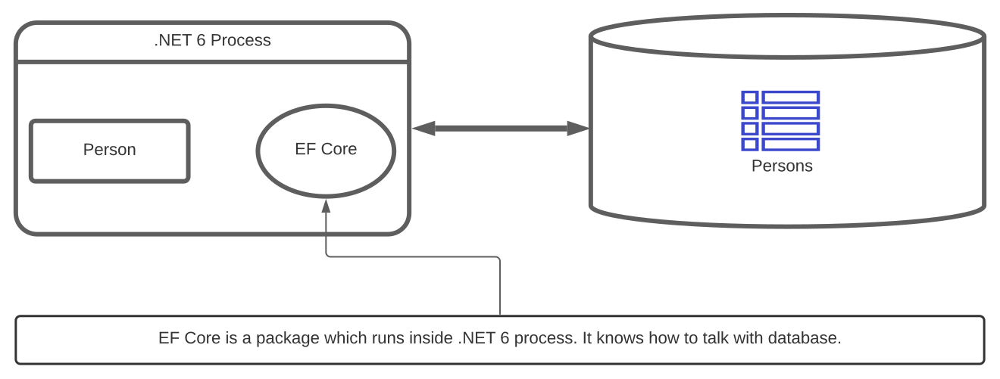

<head>
  <meta name="og:image" content="{require('./heroImage.jpg').default}" />
</head>


Image by [@abrizgalov](https://unsplash.com/@abrizgalov)

Consider developing an application that requires you to store and retrieve data and display it on UI. You will likely need two things:

1. Relational Data Management System (RDBMS) allows you to store and retrieve data permanently on disk(s) with specific [promises](https://en.wikipedia.org/wiki/ACID).
2. .NET is cross-platform, which allows you to develop different types of applications (web, console, mobile) using multiple languages (C#, F#).

Data Access in this context means making these two things (.NET & RDBMS) talk with each other. Users will interact with UI which is built using the .NET platform, which is going to learn how to talk with the database in its language (SQL).

.NET offers two different approaches to achieve data access?

- EF Core - An OR/M.
- .NET Native abstractions - without an OR/M

<!--truncate-->

# What is an EF Core?

An EF Core is an object-relational mapper enabling you to exchange data between the .NET application process and the database system of your choice. It is an open-source package used by the .NET platform and backed by Microsoft. It supports modern database engines like PostgreSQL, Microsoft SQL Server, SQLite, MySQL, etc.

An O/RM is a mapper between C# (one of the .NET platform language) constructs and database.




.NET 6 application process talking with the database.

To store and fetch data, you write SQL. SQL is a query language used by database engines. A relational database has tables that allow you to persist data. An example of selecting and inserting data into the Person table is below.

```sql
//A Person table with Id (int), Name (varchar(100)) as columns.

//Insert a person into table Person.
insert into Person(Id,Name) values(1,'Adnan');

//Select all persons from Person table.
select Id, Name from Person;
```

C# is a strongly-typed object-oriented language. It represents data shapes using constructs like classes & struct. An example of how to express Person data in C# is below.

```csharp
public class Person 
{
	public int Id {get;set;}
	public string Name {get;set;}
}

//create an object of Person
var person=new Person(){ Id=1, Name="Adnan" }
```

EF Core acting as a mapper allows you to write C# code. It knows how to map it to SQL and process database response into C# constructs. Once configured with a specific database engine, you will not need to write the SQL portion of the code. An example is below:

```csharp
//How to select all persons from the Persons table.
using (var db = new PersonContext())
{
		//This will issue select * from Persons to database, and create list of persons
    var persons= db.Persons.ToList();
}
```

Key benefits of using EF Core includes:

- It eliminates boilerplate code.
- Easy to refactor since C# is a strongly-typed language. It will allow you to catch errors on build time.
- It allows quick prototyping and provides you with a productivity boost.

## How does C# talk with the database without an O/RM?

Microsoft.Data.SqlClient NuGet package provides a set of barebones abstractions that allows your application to talk with the database.

For an application process to talk with a database, An application must know its address with valid credentials. SqlConnection abstraction gives you functions such as how to open/close a connection with the database. It also enables you to how to send commands & queries to the database.

SqlCommand abstraction allows you to define what kind of command you would like to send to the database using SqlConnection.

An example of inserting a row into database table persons shown below:

```csharp
try
{
    using SqliteConnection connection = new($"Data Source=LearnEFCore;");
    connection.Open();
    var command = connection.CreateCommand();
    command.CommandText = "insert into Persons(Id,Name) values(2,'Rafiq')";
    var rowsAffected = command.ExecuteNonQuery();
    Console.WriteLine($"Rows inserted: {rowsAffected}");
}
catch (Exception exception)
{
    Console.WriteLine(exception.Message);
}
```

Any database will likely have many tables. You will have to write SQL queries for each scenario. Since queries are text & there are no compile-time checks available for these. You are likely bound to make mistakes.
