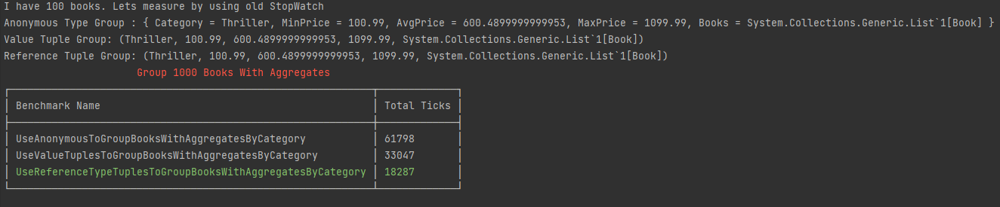
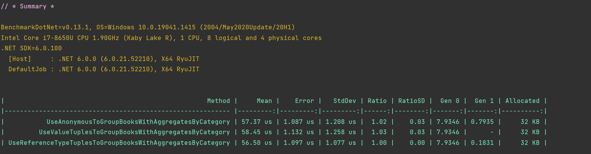

<head>
  <meta name="og:image" content="{require('./heroImage.jpg').default}" />
  <meta name="keywords" content="Tuples, C# 7.1 - 10, Value Type Tuples, Reference Type Tuples, Boxing, Unboxing, Memory Model, Stack, Heap"/>
</head>


Image by [@helloitsammiel](https://unsplash.com/@helloitsammiel)


## What are Tuples?

A Tuple is a container to hold multiple values which provide readable syntax when used appropriately. Tuples are available from C# 7 and later versions. There are two types of Tuples:

1. Value Type
2. Reference Type

Naturally, you might ask, what is the difference between Value Type and Reference Type?

The .NET runtime manages the memory for your application. It uses two distinct places to store data in memory, known as Stack and Heap. Any Value or Reference Type can end up either on Heap or Stack purely depending upon its usage.
 

> ** Mental Model **: Draw two different shapes in your head. One is fast & small, and the other is big & efficiently managed. Value Types are for small & superfast (Stack), and Reference Types for big & efficient (Heap).

I will not use Stack or Heap in rest of the post. Instead, I want you build a mental model based on two distinct memory regions.

<!--truncate-->

### Value Type

C# enables you to define custom value type using the struct keyword. Built-in value types such as int, double, and many others are structs.

> By default, value types are passed around by copying the value. It means both variables (passer & receiver) which hold the values are independent of each other.

Value Type follows pass copy of value semantics; it is necessary to keep the struct size small. Because

- Copying a large value and passing it around will be expensive.
- If it ends up on the small & superfast memory area. The large size of data can cause an out-of-memory exception.

> How Stack works is a complex implementation detail. Think of it as a small & fast memory area.


The example below shows how to define and use a custom Value Type.

```csharp
// C# 10
//initilize a struct with values 
BookStats bestSellerOfTheYearStats = new(7, 300); //Allocated in small & fast memory
Console.WriteLine($"Atomic Habits have {bestSellerOfTheYearStats}.");
//Console will print: Atomic Habits have TotalChapters: 7, TotalPages:300.

//another struct which have copy of BookStats
var bestSellerOfTodayStats = bestSellerOfTheYearStats; //Allocated in small & fast memory

//Change Total Pages - remember copy by value semantics, bestSellerOfTheYearStats is its own thing
bestSellerOfTodayStats.TotalPages = 500;

//Print value of both stats, and inspect value of TotalPages in both.
Console.WriteLine($"{bestSellerOfTodayStats.TotalPages} {bestSellerOfTheYearStats.TotalPages}");
//bestSellerOfTodayStats = TotalChapters: 7, **TotalPages:500** 
//vs 
//bestSellerOfTheYearStats = TotalChapters: 7, **TotalPages:300**

struct BookStats
{
    public BookStats(int totalChapters, int totalPages)
    {
        TotalChapters = totalChapters;
        TotalPages = totalPages;
    }
    public int TotalChapters { get; set; }
    public int TotalPages { get; set; }

    public override string ToString()
    {
        return $"{nameof(TotalChapters)}: {TotalChapters}, {nameof(TotalPages)}:{TotalPages}";
    }
}
```

### Reference Type

C# enables you to define custom reference types using the class or record keyword. There are other built-in reference types, but we will generally explore only Classes for simplicity. These are to deal with large data as opposed to value types. They get allocation on the large & efficient memory area, managed by .NET runtime with your help.

> By default, reference types are passed around by reference. It means both variables (passer & receiver) are not independent. Both passer & receiver have keys to a particular memory area consisting of a manual, which allows them to change what is inside it. It is like having a key to get into the house & move stuff around.


Think of it as a large & efficient memory area. The .NET Runtime keeps the memory area clean by killing unused objects. How .NET Runtime manages the big memory area with your help is a complex implementation detail.

An example is below.

```csharp
//Method to print book information
Action<Book> PrintBookInfo=(book /*input parameter*/)=> Console.WriteLine($"Book Information => {book.Price}");

var b=new Book("100-00-199", 100.50);//creating a book object

//Call the above method
PrintBookInfo( b /*passing object reference*/);

//initialize a new instance of book
Book bestSellerOfYear = new("100-99", BookCategory.Comedy, "Dad Jokes", "N/A", 500.99);
//print the price
Console.WriteLine($"{nameof(bestSellerOfYear)} price = {bestSellerOfYear.Price}"); 
//Output: bestSellerOfYear price = 500.99

//assign reference of bestSellerOfYear to bestSellerOfDay
var bestSellerOfDay = bestSellerOfYear;
//change the price of bestSellerOfDay to 99.99
bestSellerOfDay.Price = 99.99;
//print price of bestSellerOfDay and bestSellerOfYear 
Console.WriteLine($"{nameof(bestSellerOfDay)} price = {bestSellerOfDay.Price}  {nameof(bestSellerOfYear)} price = {bestSellerOfYear.Price}");
//Output: bestSellerOfDay price = 99.99  bestSellerOfYear price = 99.99

//Price for both is same. Because both went to the same a special memory area consisting of a manual.
//bestSellerOfDay changed price using manual, when we asked for price, both replied with same price.

public class Book
{
    public string Isbn { get; set; }
    public BookCategory BookCategory { get; set;} // Value Type Property
    public string About { get; set; }
    public string AbstractDescription { get; set;}
    public double Price { get; set;} // Value Type Property

    public Book(string isbn, BookCategory bookCategory, string about, string abstractDescription, double price)
    {
        Isbn = isbn;
        BookCategory = bookCategory;
        About = about;
        AbstractDescription = abstractDescription;
        Price = price;
    }
}
//A special value type
public enum BookCategory
{
    Thriller,
    Horror,
    Comedy,
    Nerdy
}
```

### Mixing Value & Reference Types

In the above code, the Book class defines Value Type properties. But we said that value types belong to the small & superfast particular memory area. So, where will these be allocated?

As we imagined two memory areas, big & efficient and small & superfast, would not it be easier to keep these in the big & efficient area?

Keeping them in one area is simple and easy, so we will not pay the communication cost between the two memory areas. If you noticed, the size of the reference type is big because of these properties.

On the contrary, Value Types can have properties that are reference types. Does it make sense to keep data of these properties in the small & superfast memory area?

No, because the size of the reference type can be big, thus can cause an out-of-memory exception. So what do we do now?

Since these can hold large data, they belong to the big & efficient memory area. We now know they use reference to pass value around; thus, we will store the reference in the small & superfast area along with other data. The .NET Runtime does the extra linking work for you. But it is not fast, as we are connecting two distinct memory areas. That is why you have to use the small & superfast area carefully. 

:::tip

Do not use reference type inside value type tuple or struct. For example `(string x, int a, int b)` should be avoided. Instead, use reference type tuple `Tuple.Create("some string",8,9);"` or `record SomeName(string name, int A, int B);`

:::

### Boxing and Unboxing
Boxing happens when you try to convert a value type to a reference type with an implicit cast. Boxing operation copies the value of value type, create an object in the big & efficient area, and store a reference for that object on the stack. The reverse of it is known as unboxing. 


An example of Boxing and Unboxing is below.

```csharp
//initilize a struct with values 
BookStats bestSellerOfTheYearStats = new("Atomic Habits",7, 300); 
//Above line does allocated in small & fast memory with extra work
//string is reference type. So .NET will go ahead & create the string object with the given value.
//Then reference of string type object, will be stored in small & fast memory area with 7,300

// *** Boxing/Unboxing example start  ****
double price=100.99; // On small & fast memory
object o=price; // boxing, as price value copied to large area.
double unboxedPrice=(int)price; //copied from large area & casted to double, and copied to small area. 
// *** UnBoxing example end  ****

struct BookStats
{
    public BookStats(string name,int totalChapters, int totalPages)
    {
				Name = name;
        TotalChapters = totalChapters;
        TotalPages = totalPages;
    }
		public string Name { get; set; }
    public int TotalChapters { get; set; }
    public int TotalPages { get; set; }

    public override string ToString()
    {
        return $"{nameof(Name)}: {Name}, nameof(TotalChapters)}: {TotalChapters}, {nameof(TotalPages)}:{TotalPages}";
    }
}
```

## Why do we need Tuples?

Let’s probe it with a question. How do tuples pass data around different types?

Before C# 7, there was no support to pass data with multiple values around without declaring a type for the data. Imagine, if we need to return multiple data values from a method, we will have to declare type and name it. It’s hard to name things when you put loosely related data in a  container.

The example below shows how you can return two values using Value Type Named Tuples. It returns max & min price from the list of books. It also offers various usages of tuples.

```csharp
var bookService = new BookService();
//get me max, min prices of all books belong to a category.
var thrillerPriceAggregates = bookService.CalculatePriceAggregatesBy(BookCategory.Thriller);
//Notice how we can use properties of tuple by Name hence Named Tuples
Console.WriteLine($"{nameof(thrillerPriceAggregates)} is {thrillerPriceAggregates.MaxPrice} {thrillerPriceAggregates.MinPrice}");
//tuples support deconstruction - notice variable does not need to match, and types in inferred 
var (maxPriceOfBook, minPriceOfBook) = thrillerPriceAggregates;
Console.WriteLine($"Value Tuple Deconstruction {maxPriceOfBook} {minPriceOfBook}");

//Discard one value but project first value
var (maxPrice, _ /*special operator-value is discarded*/) = thrillerPriceAggregates;
Console.WriteLine($"Value Tuple Deconstruction with discard {maxPrice}");

//Use existing variable and project value on it
double x = 500.00;
double y = 100.00;
(x, y) = thrillerPriceAggregates;
Console.WriteLine($"Project tuple values on existing variables {x+y}");

public class BookService
{
    private readonly List<Book> _books = new(); //Assume list has 1000 books.
    //Short hand named value type tuples syntax used as return type - (double MaxPrice, double MinPrice)
		public (double MaxPrice, double MinPrice) CalculatePriceAggregatesBy(BookCategory bookCategory)
    {
        var categoryBooks = _books.Where(b => b.BookCategory == bookCategory).ToList();
				//return value tuple.
        return (categoryBooks.Max(b => b.Price), categoryBooks.Min(b => b.Price));
    }
}
public class Book
{
    public string Isbn { get; set; }
    public BookCategory BookCategory { get; set; }
    public string About { get; set; }
    public string AbstractDescription { get; set; }
    public double Price { get; set; }
}
public enum BookCategory
{
    Thriller, Horror, Comedy, Nerdy
}
```

Using Value Tuples as return types has the disadvantage of making it hard for tools to find its usages. I encourage you only to use it in internal API.

We can also pass value tuples as input parameters, but methods already can have multiple input parameters. I encourage you to use that. Because using tuples syntax will hurt the readability.

Value Tuples are suitable for the small size of data. But if you need to return multiple reference types or a mix of reference & values types, then use the Reference Tuples.

```csharp
var bookService = new BookService();
//get me name of category, max, min prices of all books belong to a category.
//return type is infered as Reference Type Tuple and projection is not supported
var refTuple = bookService.CalculatePriceAggregatesBy(BookCategory.Thriller);
//Notice how values are being accessed using Item1, Item2
Console.WriteLine($"{refTuple.Item1/*category name*/} {refTuple.Item2}");

public class BookService
{
    private readonly List<Book> _books = new(); //Assume list has 1000 books.
    //Tuple<string, double, double> is return type
		//Reference type tuples do not support names
		public Tuple<string, double, double> CalculatePriceAggregatesBy(BookCategory bookCategory)
    {
        var categoryBooks = _books.Where(b => b.BookCategory == bookCategory).ToList();
				//return value tuple.
				string categoryName=Enum.GetName(bookCategory);
				var max=categoryBooks.Max(b => b.Price);
				var min=categoryBooks.Min(b => b.Price);
        return Tuple.Create(categoryName, max, min); //Return a reference type tuple, thus by ref semantics
    }
}
```

Reference Type Tuples lack of support for naming values & projection to values is not suitable for readability. I encourage you only to use it when there are performance reasons.

## Dos and Don't of Tuples

- Don’t pass as input parameters as it will hurt readability.
- Use it as return types for **non-public methods** because it is hard to find their usage.
- Limit items inside the tuple to a maximum of 4, otherwise readability will suffer.
- Do not use the Value Type Tuples when a reference type is in the mix because performance will suffer from Boxing.
- Keep an eye on the size of pure Value Type Tuple because performance will suffer if the size is big.
- Use the Value Type Tuples in scenarios where you want to increase performance.
- Use named Value Type Tuples. It is suitable for readability.
- Add Tuples support to your custom types by implementing `public void Deconstruct(out int id, out int name)` but only at specific objects. You can read more about deconstructing [here](https://docs.microsoft.com/en-us/dotnet/csharp/fundamentals/functional/deconstruct#user-defined-types).
## Alternatives to Tuples
- Create your custom type as Struct or as Class. Names will emerge over time.
- Use record which have very concise syntax `record Book(string Title, double Price);`
## Performance Comparison

Incorrect use of the Value Tuples can degrade performance. Below benchmark is grouping list of 1000 books, calculating aggregates, and then returning the Category Name, MinPrice, AvgPrice, MaxPrice, and Books in the group. Reference Type Tuples wins by a big margin because it is the correct choice of data structure. Complete code is on [GitHub](https://github.com/marafiq/production-ready-dot-net/tree/main/Tuples/Tuples).

Below benchmark is done using `StopWatch`. A reviewer asked for Benchmark using BenchmarkDotNet, which shows only minor difference but actually statistically it's no difference at all.



Below benchmark is done using [BenchmarkDotNet](https://benchmarkdotnet.org/index.html).



:::caution

Do not trust `StopWatch` at all times for benchmark, regardless of margin of difference in performance. Do not ever trust `DateTime`. Do fully understand the difference I recommend reading this [Pro .NET Benchmarking](https://link.springer.com/book/10.1007/978-1-4842-4941-3).

:::
## Feedback
It seems like you have enjoyed the post. Would it be difficult for you to share any feedback with on [Twitter](https://twitter.com/madnan_rafiq)? 
