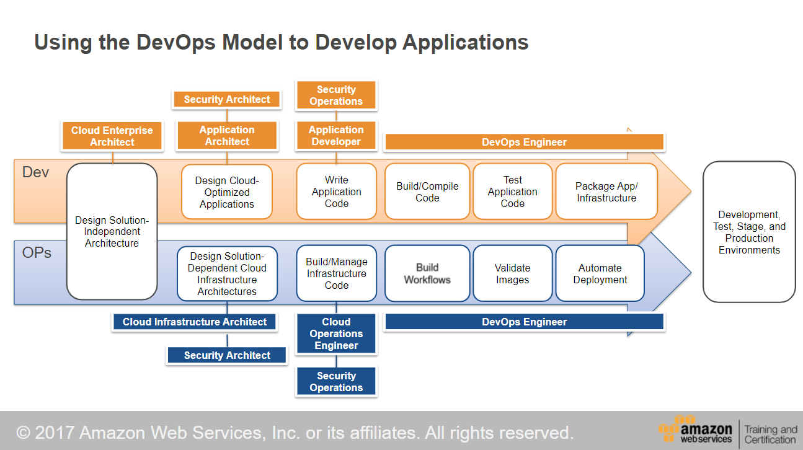

<head>

  <meta name="keywords" content="AWS, Practitioner"/>
</head>

My plan is to pass the Practitioner Certification by March 31, 2022. If you like to combine video, text resources to learn and labs for essential practice. I settled on the following resources:

- [AWS-Certified-Cloud-Practitioner_Exam-Guide.pdf (awsstatic.com)](https://d1.awsstatic.com/training-and-certification/docs-cloud-practitioner/AWS-Certified-Cloud-Practitioner_Exam-Guide.pdf)
- [https://explore.skillbuilder.aws/](https://explore.skillbuilder.aws/)
- [AWS Ramp-Up Guides - AWS Skill Builder](https://explore.skillbuilder.aws/pages/56/aws-ramp-up-guides)

<!--truncate-->

## Official AWS Exam Guide

[AWS Cloud Practitioner Exam Guide](https://d1.awsstatic.com/training-and-certification/docs-cloud-practitioner/AWS-Certified-Cloud-Practitioner_Exam-Guide.pdf) briefly outlines the skills spanning multiple services & concepts one needs to master before attempting it.

This Exam consists of 3 domains as follows:

| Domain | % of Exam |
| --- | --- |
| Cloud Concepts | 26% |
| Security and Compliance  | 25% |
| Technology | 33% |
| Billing and Pricing | 16% |
| Total: | 100% |

## AWS Skill Builder Courses

Skill builder offers free courses that have mixed content in digital, videos, and labs. [Cloud Practitioner Certification Ramp-Up Guide](https://d1.awsstatic.com/training-and-certification/ramp-up_guides/Ramp-Up_Guide_CloudPractitioner.pdf) provides structured content & links to relevant material.

This [comprehensive free course](https://explore.skillbuilder.aws/learn/learning_plan/view/82/cloud-foundations-learning-plan/enroll) is 13.5 hours long. 
I will give myself 30 hours to consume this content slowly but consistently.

## Labs and Samples

Nothing beats practice.

- [AWS Workshops](https://workshops.aws/)
- [AWS Samples (github.com)](https://github.com/aws-samples)

## Skills Map & Gap

- Experience with AWS S3
- Played around with AWS EC2 and RDS.
- Linux, Bash scripting, and networking are my weakest skills.
  - Consider polishing Linux skills by taking [Introduction to Linux (LFS101x) - Linux Foundation - Training](https://training.linuxfoundation.org/training/introduction-to-linux/) or foundational course available elsewhere.
- Staying focused & avoiding distractions will be the most significant challenge.

## Pre Exam Quiz Practice

Before exam, Dojo seems to be the most recommended resource, found on  [Home - Tutorials Dojo](https://portal.tutorialsdojo.com/).

:::note

I plan ot write and share my notes here. To keep reminding myself about the goal & consistent progress.

:::

## Notes of Day 1 of Cloud

First day notes seems more about terminology used in AWS, and seems like such questions are asked in the Exam. 

### Roles in Cloud

There are four spheres of responsibility in a cloud environment.

- Cloud Business Management
  - Finance
- Cloud Infrastructure
  - Enterprise Architect
- Cloud Security
- Cloud Application Infrastructure
  - Application Architect
    - Application Developer
    - Dev Ops Engineer

Cloud Enterprise Architect works as a glue among the above four spheres.

Infrastructure as Code (IaC) is a practice in which infrastructure is provisioned and managed using code and is automated using continuous integration and delivery. It offers the following benefits:

- Codify design.
- Iterate over the design.
- Apply your company's best practices.
- Easy to maintain.

How to use DevOps model to develop applications; see below diagram.

### What is Cloud Computing?

Cloud Computing is an on-demand delivery of IT resources over the internet with pay-as-you-go pricing. Instead of buying, owning, and maintaining physical data centers and servers, you can access technology services such as computing power, storage, and databases on an as-needed basis. Cloud Computing offers the following benefits:

- Agility
- Elasticity
- Cost Savings
- Global Reach

### AWS EC2 Cloud

AWS EC2 Cloud provides secure and resizable compute power as AWS EC2 instances in the cloud. An AWS EC2 instance is a virtual server that allows you to configure Operating System, CPU, Memory, Storage, and Network. There are four types of AWS EC2 instances. Each instance type is best suited for a specific task.

### Instance Types

- General Purpose
- Compute Optimized
- Storage Optimized
  - Storage optimized instances are designed to deliver tens of thousands of low-latency, random IOPS to applications.
- Memory-Optimized
- Accelerated Computing Optimized

### EC2 Instance Purchase Options

- On-Demand
- Savings Plan
- Save up to 72% with a 1-3 year contract.
- Reserved Instances
  - Purchase an on-demand instance for 1-3 years term with discount rates.
- Dedicated Host
  - To compliance requirements.
- Spot Instances
  - Save up to 90% over on-demand instances.

### Scalability

**Scalability** involves beginning with only the resources you need and designing your architecture to respond to changing demand by scaling out or automatically.

AWS offers auto-scaling services, which have two strategies:

- Auto Scaling
- Predictive Scaling
