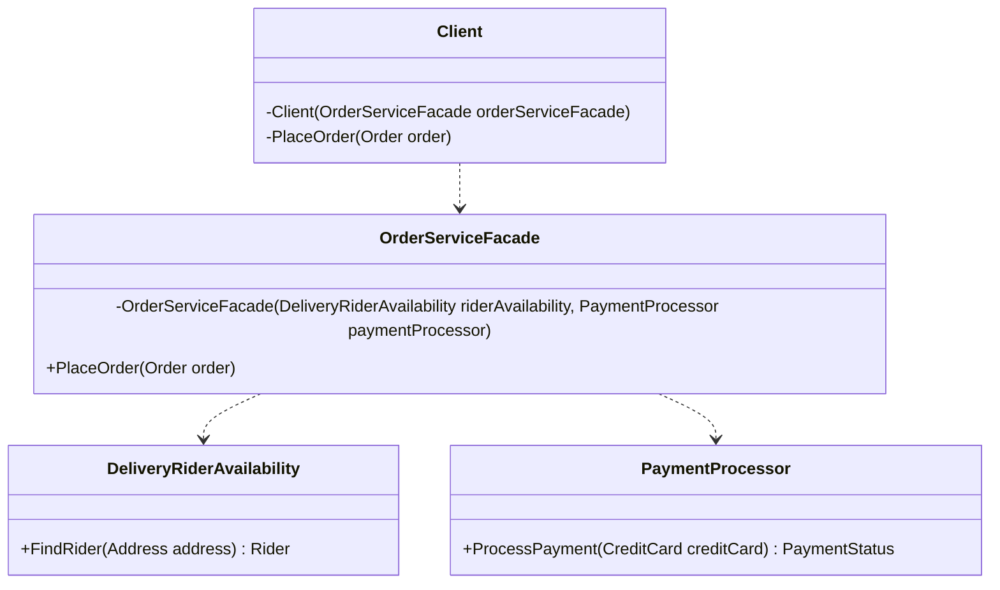

<head>

<meta property="og:image:width" content="1200"/>
<meta property="og:image:height" content="670"/>  
<meta name="twitter:creator" content="@madnan_rafiq" />
<meta name="twitter:title" content="What, Why and How of Facade Pattern in C#" />
<meta name="twitter:description" content="What is Facade Pattern? Why or what problem it solves? How to implement it in C#." />
</head>


## What is Facade Pattern?
Exposing the simplistic interface of anything complex is a Facade.
For example, when you place an order for Pizza delivery, the application hides the complex process behind Pizza Delivery to your door.
<!--truncate-->

A successful Pizza delivery order requires multiple services to participate.
Facade Pattern exposes the participating services such as Store Availability, Delivery Staff Availability, inventory of items, and others via a straightforward interface.
With a straightforward interface, it achieves the following objectives:
- It reduces the indirect coupling and eliminates direct coupling between the Consumer of the Facade and participating services.
- It hides and simplifies the interaction between the Consumer and the Facade.
- It allows you to replace the sub-system without impacting the Consumer.

The facade pattern is similar to Adapter Patter, but it hides sub-systems from its Consumer while the Adapter pattern focuses on the object or one sub-system.

## When to use Facade Pattern?
You should refactor towards Facade Pattern when:
- Interaction between the consumer class and sub-systems is getting complex and straightforward, and a stable interface can provide the most functionality of complex sub-systems.
- Replacing Legacy old sub-system(s).
## How to implement it?

The Facade Pattern is a container class that depends upon two or more classes (sub-systems) to complete the transaction it exposes via its interface to the consumer class.
A skeleton of example class is below:

```csharp title="A skelton of Facade Pattern"
//A facade which depends upon two services
class OrderServiceFacade
{
    private readonly DeliveryRiderAvailability _riderAvailability;
    private readonly PaymentProcessor _paymentProcessor;

    //Dependcies are injected using DI Container
    public OrderServiceFacade(DeliveryRiderAvailability riderAvailability, PaymentProcessor paymentProcessor)
    {
        _riderAvailability = riderAvailability;
        _paymentProcessor = paymentProcessor;
    }
    public Task PlaceOrder(Order order)
    {
        //Process Payment
        //Find rider
        //Other steps via other sevices.
        //Handle errors of participating services more gracefully
        throw new NotImplementedException();
    }
}

```

### Structure of Adapter Pattern



## Feedback
I would love to hear your feedback; feel free to share it on [Twitter](https://twitter.com/madnan_rafiq). 

