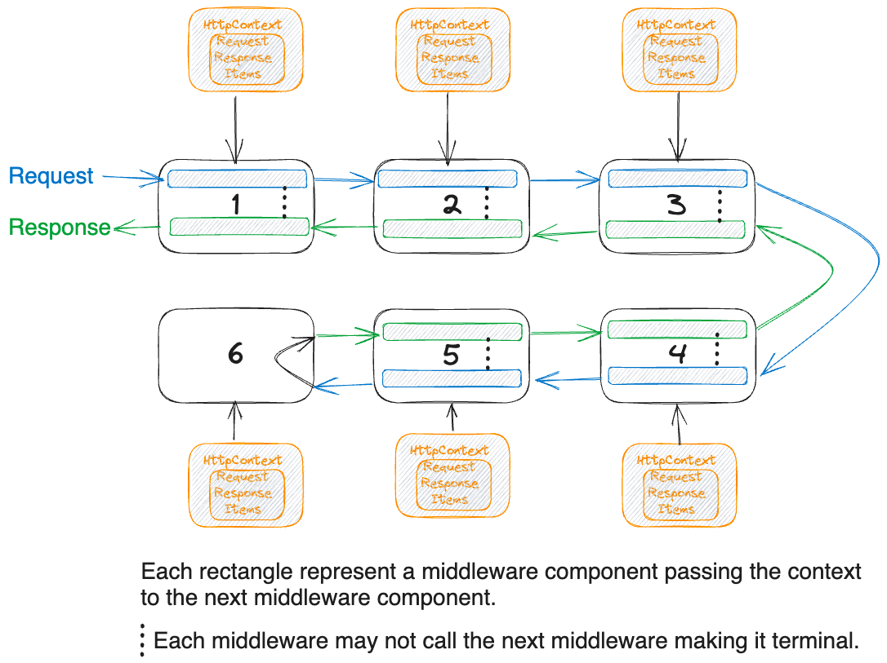

<head>

<meta property="og:image:width" content="1200"/>
<meta property="og:image:height" content="500"/>  
<meta name="twitter:creator" content="@madnan_rafiq" />
<meta name="twitter:card" content="summary_large_image" />
<meta name="twitter:title" content="Develop Intuitive Understanding of Middleware in ASP.NET 8" />
<meta name="twitter:description" content="What comes to your mind when you hear the word middleware? In the middle of two ware's, right? Obviously, but not clear and intuitive. Let's try to understand the middleware in ASP.NET 8." />
</head>

# The Middleware

What comes to your mind when you hear the word **middleware**?

Middle of nowhere. 🃏😆 But that's not the case here.

In the middle of two _soft(wares)_, right? 
But in the context of the ASP.NET 8 why do you need it? What does it do? How does it work?
<!--truncate-->

## What is Middleware?

> Middleware is a software component assembled into an application pipeline to handle requests and responses.

In the ASP.NET 8,
the middleware is a single responsibility function or a class which is added to the application pipeline to handle a specific functionality.
The ASP.NET 8 has three ways to add middleware to the pipeline:
- Inline Middleware — A function.
- Class Middleware — A class.
- Factory-based Middleware — A class implementing an interface.

Before you learn how to create and use a .NET middleware. Would it be a bad idea to understand why you need it?

## Why do you need Middleware?

Basic definitions of terms used in the middleware below:
- **Request** - A HTTP request is payload sent by the client to the server.
- **Response** - A HTTP response is payload sent by the server to the client.
- **Application Pipeline** - The series of _ordered steps_ that are executed to handle a request and generate a response.
- **Software Component** - A class or a function to perform a specific task (_step_).

HTTP is a protocol to exchange messages between the client and the server.
The message sent by the client to server is HTTP Request, and the message sent back to the client is HTTP Response.
The protocol means there are rules in place to exchange a message in a format understood by both client and server.
A very high-level exchange of messages is below:

But the message route to the server involves many software layers generally known as Proxies.
Each proxy performs a different function such as caching, routing, etc.
But we can label them as Middleware as the layer is in the middle of a long pipeline, such as:

Your key concern is what middleware has to do with the ASP.NET 8?
As soon as the server receives the HTTP Request Message, it has to understand it and respond back to the client.
To generate the response, the .NET must allow you to perform the computation.

It can be as simple as seen below.

But you might ask that this might be okay to build a very high-level understanding of the exchange, 
but in real applications, there are many things that need to be done before sending out the response like:
- How the .NET decides which handler to call?
- How the .NET decides about the user's authenticity?
- How the .NET decides about the user is authorized to view the data?
- How the .NET decides if the request payload is valid?
- How the .NET converts the request payload into C# objects?
- How to log what request payload comes in?

If I ask you
to write a framework which abstracts away the complexities of understanding the HTTP request
and allows the developers to hook their custom logic.
How would you design it?

Your answer: It seems like that there are many steps the server has to perform before it can generate an HTTP response.
So it would be best if you divide the steps to form a pipeline, 
so the output of one step becomes the input of the next step.
This way a message is being massaged and passed to the next step, 
but each step is performing one thing and easy to reason about,
allows you to compose a small or long pipeline depending upon the requirements.

But you might say,
there are steps that are best suited for the framework to handle like HTTP Connection Management,
reading the streams, and sending the response back.
So we can hide it from the developers and only provide hooks where needed.
And there are steps like Routing, Authentication, Authorization, Logging,
ErrorHandling, Caching, Compression, Enforcing HTTPS etc.
which are common in most applications, 
so the framework can provide these as built in steps with the ability to hook custom behavior.
In technical jargon, these steps are known as Cross-Cutting Concerns.

That is exactly how the ASP.NET 8 implements the request/response mechanism.
That is by composing a pipeline of single responsibility middleware components.
You can visualize the ASP.NET 8 pipeline as below:

The names are omitted intentionally as the pipeline can be composed of any number mixing built-in and custom middlewares. 

## How to create a Middleware?
The ASP.NET 8 process the request by composing a pipeline made of middleware components.
The pipeline composition is done using the `Use` convention. You can define inline middleware as shown below.

~~~csharp title="Inline Middleware"
app.Use(async (HttpContext context, RequestDelegate next) =>
{
    var logger = context.RequestServices
        .GetRequiredService<ILoggerFactory>()
        .CreateLogger("Middleware");
    var httpRequest = context.Request;
    context.Items.Add("RequestPath", httpRequest.Path);

    logger.LogInformation("P");
    await next(context);
    logger.LogInformation("E");

    var httpResponse = context.Response;
    httpResponse.OnStarting(() =>
    {
        logger.LogInformation("OnStarting Part");
        return Task.CompletedTask;
    });
});
//Another Middleware
app.Use(async (HttpContext context, RequestDelegate next) =>
{
    logger.LogInformation("I");
    await next(context);
    logger.LogInformation("P");
});
~~~

A middleware component has the following characteristics:
- `HttpContext` object to manipulate the request and response.
- `RequestDelegate` object to call the next middleware in the pipeline. If you do not call the next, the pipeline will be short-circuited.

### Role of Next RequestDelegate (Middleware)
The middleware components are composed together to form a pipeline in an order.
If you run the above two middlewares, it will log the word "PIPE" in the logs.
Because when the first middleware gets called, the flow is as follows:
1. It logs the letter "P"
2. It calls the next middleware in the pipeline
3. The second middleware logs the letter "I"
4. It calls the next middleware in the pipeline. Now the next middleware is the terminal middleware, which does not call the next middleware in the pipeline. Thus, the control returns to the second middleware.
5. The second middleware logs the letter "P"
6. The first middleware logs the letter "E"

### Role of HttpContext
The `HttpContext` object holds all the information about the current request only,
and it will be isolated from the other requests.
The context _importantly_ includes the following but not limited to:
- `Request` object to read the request headers, body, and other information.
- `Response` object to write the response headers, body, and other information.
- `Items` dictionary to store the information which can be used by the other middleware components in the pipeline.
- `RequestServices` object to access the services registered in the DI container.
- `User` object to access the information about the current user.

The important thing to note is that information stored is shared among the middleware components in the pipeline.
It means that if you add an item in the `Items` dictionary in the first middleware,
it will be available in the second middleware and so on.

### Role of ResponseStarted and ResponseCompleted

Any Middleware can manipulate the response, but the response cannot be modified after the response headers are sent to the client. 
Thus, the middleware can subscribe to the `ResponseStarted` event to perform any action after the first byte of the response is sent to the client.

Similarly, the middleware can subscribe to the `ResponseCompleted` event to perform any action after the response is completed. 

## Feedback
I would love to hear your feedback, feel free to share it on [Twitter](https://twitter.com/madnan_rafiq). 

