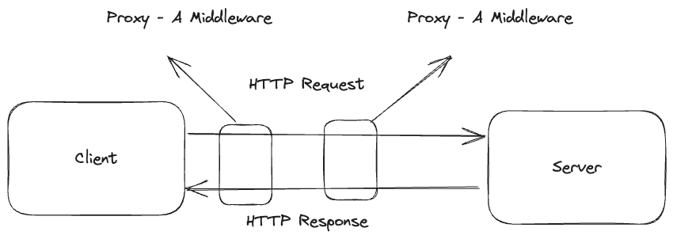
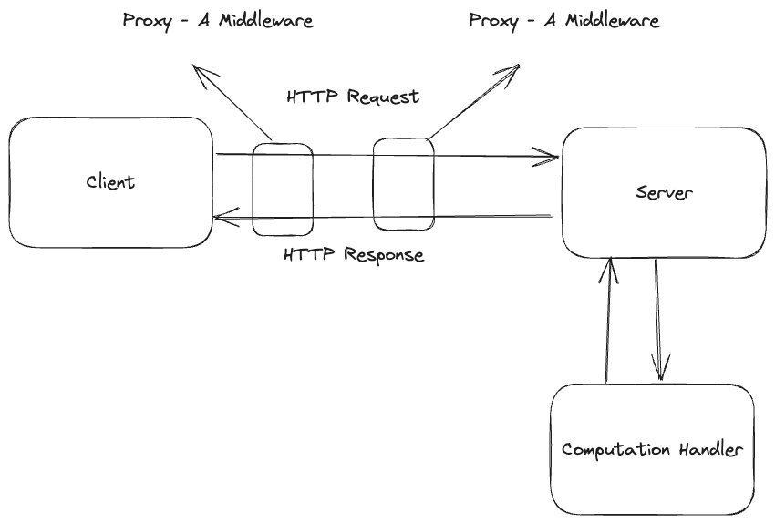
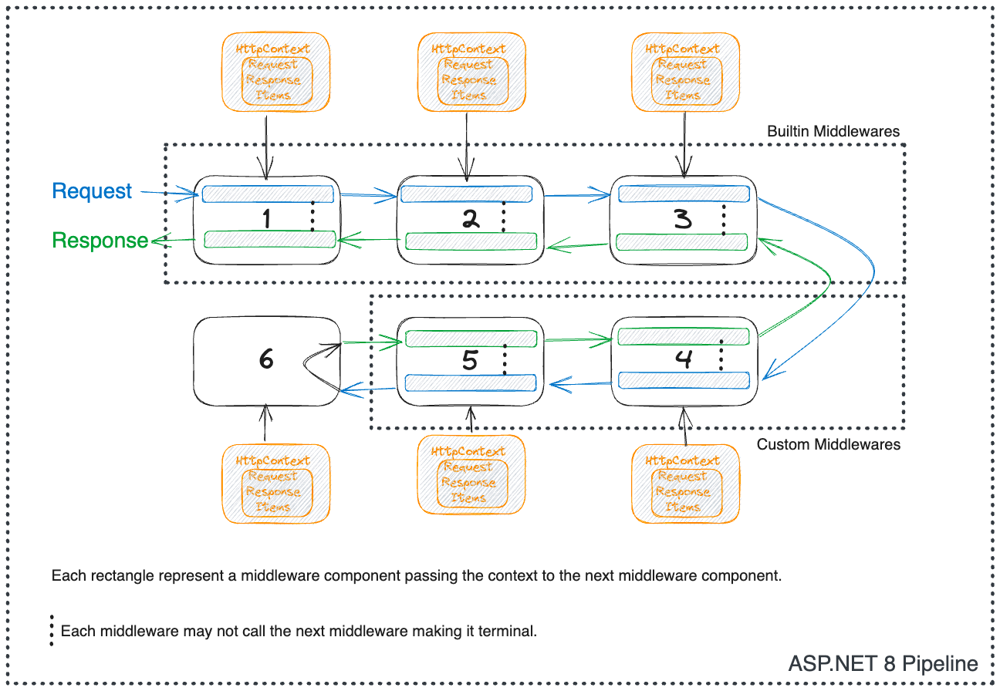
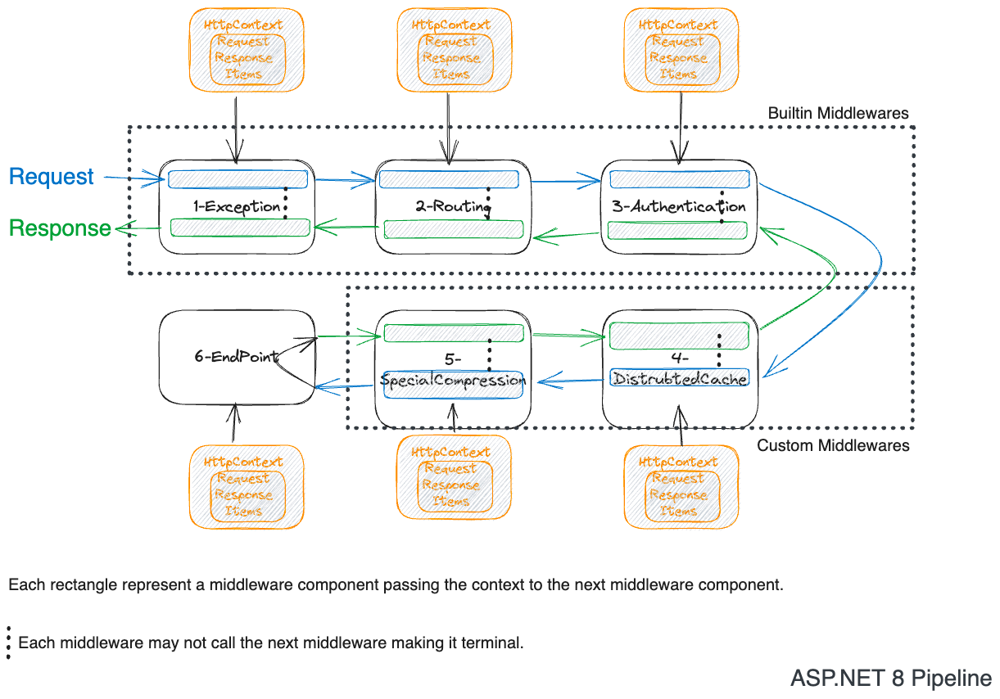

<head>

<meta property="og:image:width" content="1200"/>
<meta property="og:image:height" content="500"/>  
<meta name="twitter:creator" content="@madnan_rafiq" />
<meta name="twitter:card" content="summary_large_image" />
<meta name="twitter:title" content="Develop Intuitive Understanding of Middleware in ASP.NET 8" />
<meta name="twitter:description" content="What comes to your mind when you hear the word middleware? In the middle of two ware's, right? Obviously, but not clear and intuitive. Let's try to understand the middleware in ASP.NET 8." />
</head>


# The Middleware

What comes to your mind when you hear the word **middleware**?

Middle of nowhere. 🃏😆 But that's not the case here.

In the middle of two _soft(wares)_, right? 
But in the context of the ASP.NET 8 why do you need it? What does it do? How does it work?
<!--truncate-->

## What is Middleware?

> Middleware is a software component assembled into an application pipeline to handle requests and responses.

In the ASP.NET 8,
the middleware is a single responsibility function or a class which is added to the application pipeline to handle a specific functionality.
The ASP.NET 8 has three ways to add middleware to the pipeline:
- Inline Middleware — A function.
- Class Middleware — A class.
- Factory-based Middleware — A class implementing an interface.

> Every middleware component makes one key decision of calling next or not.
> If it doesn't call, the pipeline ends and starts to flow in reverse order.
> Otherwise, it keeps calling the next until the end of the pipeline is found.

Before you learn how to create and use a .NET middleware. Would it be a bad idea to understand why you need it?

## Why do you need Middleware?

Any framework or protocol comes with a set of features out of the box.
But it must allow consumers to extend it to meet the requirements.
That means:
> Middleware is a way to extend the framework.

Naturally, you ask: There are many ways to expose extension points then What is special about middleware?

Nothing special.
Extension points are exposed using the regular language constructs like Interface,
Functions, etc. 

Special is that when extension points are offered in a pipeline, then it is known as middleware.
Seriously, they could have chosen the name **Pipeline Hooks**.

Why pipeline?

When a request travels from point A to B and then reaches back to A from B,
and on the way, it passes different points, it is treated with custom logic.

Such flow is referred to as a pipeline. 

Would it be a bad idea to have a brief high-level understanding of middleware in HTTP protocol and then ASP.NET 8?

### HTTP Middleware
Basic definitions of terms to start with:
- **Request** - A HTTP request is payload sent by the client to the server.
- **Response** - A HTTP response is payload sent by the server to the client.
- **Application Pipeline** - The series of _ordered steps_ that are executed to handle a request and generate a response.
- **Software Component** - A class or a function to perform a specific task (_step_).

HTTP is a protocol to exchange messages between the client and the server.
The message sent by the client to server is HTTP Request, and the message sent back to the client is HTTP Response.
The protocol means there are rules in place to exchange a message in a format understood by both client and server.
A very high-level exchange of messages is below:


But the message route to the server involves many software layers generally known as Proxies.
Each proxy performs a different function such as caching, routing (API Gateway, LoadBalancer etc), etc.
But we can label them as Middleware as the layer is in the middle of a long pipeline, such as:



### ASP.NET Middleware
Your key concern is what middleware has to do with the ASP.NET 8?
As soon as the server receives the HTTP Request Message, it has to understand it and respond back to the client.
To generate the response,
the .NET must perform a series of steps and allow you to perform the computation such as getting data from the database.

It can be as simple as seen below.



But you might ask that this might be okay to build a very high-level understanding of the exchange, 
but in real applications, there are many things that need to be done before sending out the response like:
- How the .NET decides which handler to call?
- How the .NET decides about the user's authenticity?
- How the .NET decides about the user is authorized to view the data?
- How the .NET decides if the request payload is valid?
- How the .NET converts the request payload into C# objects?
- How to log what request payload comes in?

With the above questions in mind, If I ask you
to write a framework which abstracts away the complexities of understanding the HTTP request
and allows the developers to hook their custom logic.
How would you design it?

Your answer: It seems like that there are many steps the server has to perform before it can generate an HTTP response.
So it would be best if you divide the steps to form a pipeline, 
so the output of one step becomes the input of the next step.
This way a message is being massaged and passed to the next step, 
but each step is performing one thing and easy to reason about,
allows you to compose a small or long pipeline depending upon the requirements.

But you might say,
there are steps that are best suited for the framework to handle like HTTP Connection Management,
reading the streams, and sending the response back.
So we can hide it from the developers and only provide hooks where needed.
And there are steps like Routing, Authentication, Authorization, Logging,
ErrorHandling, Caching, Compression, Enforcing HTTPS etc.
which are common in most applications, 
so the framework can provide these as built in steps with the ability to hook custom behavior.
In technical jargon, these steps are known as Cross-Cutting Concerns.
Basically two kinds of steps:
1. Cross-Cutting Concern Components
2. Custom Logic Components

That is exactly how the ASP.NET 8 implements the request/response mechanism.
That is by composing a pipeline of single responsibility middleware components.
You can visualize the ASP.NET 8 pipeline as below:


The names of the middlewares in the above diagram are omitted intentionally. 

So far, you have developed a high-level understanding of the middleware and pipeline.
But the question is which middleware should a framework support out of the box?

## Wishlist of Middleware Components
If I ask you to provide a wishlist of the middleware components
that a framework should support out of the box so that you can do the following:
- Focus on the core business logic of the application.
- Build a pipeline tailored to your application needs.
- Secure and performant API.

What would be your wishlist? And what kind of programming interface would you like to have?

You are excited to provide the list of middleware components,
but you decide to take a more pragmatic approach by building a Course API.

You have gathered a list of courses over the years
and would like to provide an API so users can get the list and use it.

You say, an endpoint `https://adnanrafiq.com/api/courses` should return the list of courses.

The first challenge is
how to map the HTTP Request for the resource on the above URL to a .NET Handler
so the response can be returned.
The ASP.NET 8 provides a way to map the incoming request to a handler.
Let's take a look at the code below using ASP.NET 8 minimal API.

```csharp title="Map HTTP Request to Handler"

var builder = WebApplication.CreateBuilder(args);

var app = builder.Build();

app.MapGet("/api/courses", () => new string[] { "Course 1", "Course 2" });

app.Run();

```

The line `app.MapGet("/api/courses", () => new string[] { "Course 1", "Course 2" });` maps the incoming HTTP Request to a handler
which is an inline lambda function.
The lambda function returns the list of courses.

The magic of mapping `/api/courses` to handler function is hidden,
because the .NET 8 framework is automatically adding the middleware responsible for mapping the incoming request to a handler.
The middleware is known as Routing Middleware.
But you can also add the middlewares explicitly as shown below.
The `app.UseRouting();` adds the routing middleware to the pipeline.

```csharp title="Explicitly Adding Middlewares"
var builder = WebApplication.CreateBuilder(args);
var app = builder.Build();
app.UseRouting(); 
app.MapGet("/api/courses", () => new string[] { "Course 1", "Course 2" }); //database.GetCoursesAsync();
app.Run();
```
The purpose of routing middleware is to parse the HTTP request payload
and find a matching endpoint defined in the application so the handler can be invoked.
How does it find the match?
It is a complex algorithm, but it is not the focus of this blog post.
Though I will give you a gist. 

An HTTP request payload carries information about the HTTP Method (GET, POST, PUT, DELETE etc) and the URL.
When the below payload arrives at server, the routing middleware parses it and finds the matching endpoint because
1. The HTTP Method is GET
2. The URL Part is `/api/courses`

If the HTTP Method is a POST and the URL Part is `/api/courses`,
the routing middleware will not find a match because there is no endpoint defined for the POST method.

```http request title="HTTP Request Payload"
GET /api/courses HTTP/1.1
Host: adnanrafiq.com
Content-Type: application/json

```
You can map an endpoint by using the HTTP request method, Url, Query String, and Header Values. 

Moving on to the next requirement, you say that I would like to return a custom error if getting the courses fails.
The ASP.NET 8 provides a `ExceptionHandler` middleware to handle the exceptions and return custom error responses.
If I add to the `UseExceptionHandler` right after the `UseRouting` middleware,
it will handle the exceptions thrown by the handler.
But what if the exception is thrown by the routing middleware itself?
Will it be caught by the `UseExceptionHandler` middleware?

The answer is no,
because in the pipeline the exception middleware comes after the routing middleware, 
which means
that routing middleware will never be able to call the exception middleware as it encountered an unexpected exception.

That is where ordering of the middleware is important.
If you want to handle the exceptions thrown by any middleware component in the pipeline.
It has to be added before the middleware component which throws the exception.
So the `UseExceptionHandler` middleware should be added before the `UseRouting` middleware.

Similarly, it would not make sense to add the authorization middleware before the authentication middleware.
Or the Cors middleware after the authentication middleware.

Finally, the middleware responsible to execute the handler and return the response is known as the Endpoint Middleware.
It is the last middleware in the pipeline.

Anything in between the exception middleware and the endpoint middleware should be listed explicitly in the pipeline.
You should reason about it
by looking at the flow of HTTP Request going through the series of steps, 
but which steps should be performed early in the pipeline depends upon the requirement.

```csharp title="Between Exception Handling and Endpoint Middleware"
var builder = WebApplication.CreateBuilder(args);
var app = builder.Build();
app.UsePathBase("/api");
app.UseExceptionHandler(new ExceptionHandlerOptions()
{
    AllowStatusCode404Response = false,
});
app.UseRouting();
app.UseCors();
app.UseAuthentication();
app.UseAuthorization(); 
app.MapGet("/api/courses", () => new string[] { "Course 1", "Course 2" }); //database.GetCoursesAsync();
app.Run();

```

Now you say that the list of courses can be really long, and it changes every day. What are options?
- Perhaps compress the response payload.
- Cache the response payload.

Where would you add the compression middleware?
It should be added before the endpoint middleware
so that the response payload can be compressed before sending it to the client.
So right before the MapGet, you will add `app.UseResponseCompression();`

Where would you add the caching middleware?
It should be added after the routing middleware
so that the cached response can be returned as soon as the HTTP request route is matched.
But this would mean that cached response will be returned to non-authenticated users as well.
So you would add the caching middleware after the authorization middleware.
So right after the UseAuthorization, you will add `app.UseResponseCaching();`

Lastly, you say that I would like to have some observability into the application by enabling logging. 
Where would you add the logging middleware? 
It should be added after the exception middleware.
You might disagree and say that it should be added before the exception middleware.

All the features you have wished so far are available in the ASP.NET 8 out of the box.
But it is not the complete list.
The complete list is [ASP.NET 8 Default Middlewares](https://learn.microsoft.com/en-us/aspnet/core/fundamentals/middleware/?view=aspnetcore-8.0#built-in-middleware).

Few open questions for you to think about:
- Where would you add the middleware to enforce HTTPS redirection?
- Where would you add the middleware to enforce HSTS?
- where would you add the middleware to add CSP - Content Security Policy header?

:::note
You might have noticed it is not worth it memorizing the order of the middleware components.
Instead, you should visualize them as a pipeline and add them in the order which meets the requirement.
And doing it explicitly makes it more readable.
:::

The below diagram shows the ASP.NET 8 pipeline with the middleware components added explicitly.



You can create custom middleware and add it to the pipeline at any point. But what is this `Use` convention?

To improve the readability, discoverability and shared knowledge in the dotnet community,
it is recommended to follow `Use` convention.
It is an extension method on the `IApplicationBuilder` interface.

I would write an extension method on the `IApplicationBuilder` interface.

```csharp title="Use Extension Method"
public static IApplicationBuilder UseSpecialCoursesFeatureFlag(this IApplicationBuilder app)
{
    ArgumentNullException.ThrowIfNull(app);
    return app.UseMiddleware<SpecialCoursesMiddleware>();
    //OR
    // return app.Use((context, next) => next(context));
}
```

In the next section, you will learn how to create custom middleware.

## How to create a Custom Middleware?
The ASP.NET 8 has provided three different ways to create the middleware.
- Inline Middleware — A function.
- Class Middleware — A class but follows a convention.
- Factory-based Middleware — A class implementing an interface.

### Inline Middleware

The ASP.NET 8 exposes an extension method on the `IApplicationBuilder` interface to add the inline middleware.
The extension method follows the `Use` convention and accepts a function.
The runtime will call the function with the `HttpContext` object and the `RequestDelegate` object.
Sample middleware is below:

~~~csharp title="Inline Middleware"
// Order Number 1 in the pipeline
// Middleware adding item to the Items dictionary
// Logging some stuff
app.Use(async (HttpContext context, RequestDelegate next) =>
{
    // You can resolve scoped services present in DI container
    // Whe resolving any service in the middleware, you should be aware of the lifetime of the service
    var logger = context.RequestServices
        .GetRequiredService<ILoggerFactory>()
        .CreateLogger("Middleware");
    var httpRequest = context.Request;
    context.Items.Add("RequestPath", httpRequest.Path);

    logger.LogInformation("P");
    await next(context);
    logger.LogInformation("E");

    //It is explained later in this blog post
    var httpResponse = context.Response;
    httpResponse.OnStarting(() =>
    {
        logger.LogInformation("OnStarting Part");
        return Task.CompletedTask;
    });
});
//Order number 2 in the pipeline
app.Use(async (HttpContext context, RequestDelegate next) =>
{
    //logger.LogInformation(content.Items["RequestPath"]);
    logger.LogInformation("I");
    return next(context);
    logger.LogInformation("P");
});
~~~

Few things to note:
- You **cannot** inject any service in the function because the signature does not allow it, but you can resolve using `RequestedServices`. But it should be avoided as you cannot clearly see the dependencies.
- When calling `next`, it is recommended to use `return next(context);` instead of `next();` as it is more performant.
- If the pipeline is made of many middlewares, inline middleware does not have names, so it will be hard to find which middleware it is.
- You should consider
  writing an extension method with `Use{YourMiddlewareNameß}` on `IApplicationBuilder` to add the inline middleware as it the common convention.

A middleware component has the following characteristics:
- `HttpContext` object to manipulate the request, response, and items.
- `RequestDelegate` object to call the next middleware in the pipeline. If you do not call the next, the pipeline will be short-circuited.

### Role of Next RequestDelegate (Middleware)
The middleware components are composed together to form a pipeline in an order.
If you run the above two middlewares, it will log the word "PIPE" in the logs.
Because when the first middleware gets called, the flow is as follows:
1. It logs the letter "P"
2. It calls the next middleware in the pipeline
3. The second middleware logs the letter "I"
4. It calls the next middleware in the pipeline. Now the next middleware is the terminal middleware, which does not call the next middleware in the pipeline. Thus, the control returns to the second middleware.
5. The second middleware logs the letter "P"
6. The first middleware logs the letter "E"

### Role of HttpContext
The `HttpContext` object holds all the information about the current request only,
and it will be isolated from the other requests as long as it is inside the pipeline.
The context _importantly_ includes the following but not limited to:
- `Request` object to read the request headers, body, and other information.
- `Response` object to write the response headers, body, and other information.
- `Items` dictionary to store the information which can be used by the other middleware components in the pipeline.
- `RequestServices` object to access the services registered in the DI container.
- `User` object to access the information about the current user.

:::note
The important thing to note is that information stored is shared among the middleware components in the pipeline.
It means that if you add an item in the `Items` dictionary in the first middleware,
it will be available in the second middleware and so on.
:::

### Role of ResponseStarted

Any Middleware can manipulate the response, but the response cannot be modified after the response headers are sent to the client. 
Thus, the middleware can subscribe to the `httpContext.ResponseStarted` event to perform any action after the first byte of the response is sent to the client.
This event can be subscribed in multiple middlewares in the pipeline,
but it will be called in the reverse order it is defined.

> You cannot change an operation which has already been started. 

The below middleware will throw an exception that response as started and headers are readonly. 

```csharp title="An Middleware which adds security headers to the response - Wont work"

app.Use(async (HttpContext context, RequestDelegate next) =>
{
    
    await next(context);
    context.Response.Headers.Add("X-Frame-Options", "SAMEORIGIN");
    context.Response.Headers.Add("X-XSS-Protection", "1; mode=block");
    context.Response.Headers.Add("X-Content-Type-Options", "nosniff");
    context.Response.Headers.Add("Content-Security-Policy", "default-src 'self';");
});

```

:::tip
`OnStarting` must be registered before calling the next middleware.
:::

```csharp title="An Middleware which adds security headers to the response - Will work"

app.Use(async (HttpContext context, RequestDelegate next) =>
{
    //Must register the event before calling the next middleware
    context.Response.OnStarting( () =>
    {
        //will be called second
        context.Response.Headers.Add("X-Frame-Options", "SAMEORIGIN");
        context.Response.Headers.Add("X-XSS-Protection", "1; mode=block");
        context.Response.Headers.Add("X-Content-Type-Options", "nosniff");
        context.Response.Headers.Add("Content-Security-Policy", "default-src 'self';");
        return Task.CompletedTask;
    });
    
    //Pass the state to on starting function
    var state = "Complex State which is not part of the context items";
    context.Response.OnStarting(data =>
    {
        //Will be called first
        app.Logger.LogInformation("State is {Data}", data);
        return Task.CompletedTask;
    },state);
    
    await next(context);
});

```

### Role of ResponseCompleted
The middleware can subscribe to the `httpContext.ResponseCompleted` event to perform any action after the response is completed.
It is useful to log, audit, dispose, or perform any action after the response is completed.

```csharp title="An Middleware which logs the response completion"
app.Use(async (HttpContext context, RequestDelegate next) =>
{
    context.Response.OnCompleted(() =>
    {
        app.Logger.LogInformation("I get called second");
        return Task.CompletedTask;
    });
    var state = "Complex State which is not part of the context items";
    context.Response.OnCompleted(data =>
    {
        app.Logger.LogInformation("I get called first");
        app.Logger.LogInformation("State is {Data}", data);
        return Task.CompletedTask;
    },state);
    await next(context);
});
```

### Class Middleware - A class but follows a convention

A convention is nothing but a set of rules which you must have to follow so the framework can discover your middleware.

The convention middleware has the following rules:
1. The class must have a constructor with the following signature `public NameofYourMiddleware(RequestDelegate next)`.
2. The class must have a method with the following signature `public Task InvokeAsync(HttpContext context)`.
3. You can inject any service in the `InvokeAsync` method after the first parameter `HttpContext context`. And you can inject singleton services inside the constructor as well.
4. You must call the `UseMiddleware<NameofYourMiddleware>()` extension method on the `IApplicationBuilder` interface to add the middleware to the pipeline.


```csharp title="Class Middleware"

//Primary constructor is used in the class
public class DistributedCacheMiddleware(RequestDelegate next)
{
    //Services can only be injected inside the InvokeAsync method
    public Task InvokeAsync(HttpContext context, IConfiguration configuration)
    {
        //Do the work
        return next(context);
    }
}

//Then use it with app.UseMiddleware<FeatureFlagRoutePathMiddleware>(); 
//OR create the extension method on IApplicationBuilder 

public static class MiddlewareExtensions{

    public static IApplicationBuilder UseFeatureFlagRoutePath(this IApplicationBuilder app)
    {
        return app.UseMiddleware<FeatureFlagRoutePathMiddleware>();
    }
}

```

### Middleware — A class implementing an interface

The ASP.NET 8 provides an interface `IMiddleware` to create middleware.
Once you implement the logic inside the `InvokeAsync` method,
you can add it to the pipeline using the `UseMiddleware<T>()` extension method.

:::note
You must add the middleware to the service's collection using the `AddTransient` method otherwise it would not work.
:::

It allows you
to inject services inside the constructor of the middleware class
where other two types of middleware do not allow constructor injection.

```csharp title="IMiddleware Interface to create a middleware"
public class SecurityHeadersMiddleware : IMiddleware
{
    private readonly IConfiguration _configuration;

    public SecurityHeadersMiddleware(IConfiguration configuration)
    {
        _configuration = configuration;
    }
    public Task InvokeAsync(HttpContext context, RequestDelegate next)
    {
        return next(context);
    }
}
```

## Difference among the three ways to create middleware

| Feature                            | Inline Middleware    | Convention Middleware                                                 | Factory-based Middleware   |
|------------------------------------|----------------------|-----------------------------------------------------------------------|----------------------------|
| DI Services Injection              | httpContext.Services | Inject in InvokeAsync Or Constructor injection for singleton services | Via Constructor            |
| Explicit Registration              | No                   | No                                                                    | Yes                        |
| Name of Middleware while Debugging | No                   | Yes                                                                   | Yes                        |
| Use with ThirdParty IoC Containers | No                   | Yes                                                                   | Yes - `IMiddlewareFactory` |


All approaches have their pros and cons.
I would recommend picking one which makes your code readable, testable and maintainable for you and your team.

## Build your own Middleware Pipeline Using the ASP.NET 8 Approach

Copy the below code in a console application and run it.
It would be best if you debug it to understand the flow.
It builds a custom middleware pipeline, which behaves exactly like the ASP.NET 8 pipeline.

```csharp title="Build your own Middleware Pipeline"
// List of middleware functions in the pipeline:
// It is list of functions that take a HookDelegate and return a HookDelegate
// HookDelegate is a delegate that takes a HookContext and returns a Task

var middlewareList = new List<Func<HookDelegate, HookDelegate>>
{
    next => async context =>
    {
        Console.WriteLine("First delegate handling");
        await next(context);
        Console.WriteLine("First delegate after next");
    },
    next => async context =>
    {
        Console.WriteLine("Second delegate handling");
        await next(context);
        Console.WriteLine("Second delegate after next");
    },
    next => async context =>
    {
        Console.WriteLine("Third delegate handling");
        await next(context);
        Console.WriteLine("Third delegate after next");
    }
};

// Create an application function - It represents the handler
HookDelegate app = context =>
{
    Console.WriteLine("Final delegate handling");
    return Task.CompletedTask;
};

//Add one more middleware to the pipeline - List of functions
app.Use(async (hookContext, next) =>
{
    Console.WriteLine("Custom first delegate handling");
    await next(hookContext);
    Console.WriteLine("Custom first delegate after next");
}, middlewareList);

// Loop in reverse order so that the middleware at index zero will execute first
// and the middleware at the end of the list will execute last
for (var c = middlewareList.Count - 1; c >= 0; c--)
{
    var middleware = middlewareList[c];
    var next = app;
    app = middleware(next);
}
// On first iteration of the loop c=3
// middlewareList[3] is the last middleware in the list
// next is the app function which is the handler and you want it to execute it in the end
// so you pass the app variable value which is a function to the middleware function which returns a function
// and assign it to the app variable. 

// On second iteration of the loop c=2
// middlewareList[2] is the second last middleware in the list
// next is the function returned by the first iteration of the loop
// so you pass the next variable value which is a function to the middleware function which returns a function
// and assign it to the app variable.

// On third iteration of the loop c=1
// middlewareList[1] is the third last middleware in the list
// next is the function returned by the second iteration of the loop
// so you pass the next variable value which is a function to the middleware function which returns a function
// and assign it to the app variable.

// On fourth iteration of the loop c=0
// middlewareList[0] is the fourth last middleware in the list
// next is the function returned by the third iteration of the loop
// so you pass the next variable value which is a function to the middleware function which returns a function
// and assign it to the app variable.

// create a context variable
var context = new HookContext();

// Here we call the app function.
// app function now contains a function returned by the last iteration of the loop
await app(context);
// when it gets called what happens? read the loop comments above in reverse order

Console.ReadLine();

class HookContext
{
    public Dictionary<string, object> Items { get; private set; } = new();
}

delegate Task HookDelegate(HookContext context);

//write a extension method for HookDelegate to add a middleware
static class HookDelegateExtensions
{
    private static HookDelegate Use(this HookDelegate app, Func<HookDelegate, HookDelegate> middleware,
        List<Func<HookDelegate, HookDelegate>> middlewareList)
    {
        var m = middleware(app);
        middlewareList.Add(middleware);
        return m;
    }

    public static HookDelegate Use(this HookDelegate app, Func<HookContext, HookDelegate, Task> middleware,
        List<Func<HookDelegate, HookDelegate>> middlewareList)
    {
        return app.Use(next => context => middleware(context, next), middlewareList);
    }
}
```

The ASP.NET 8 calls the pipeline as a request delegate on each request can be seen here [Source Code](https://github.com/dotnet/aspnetcore/blob/main/src/Hosting/Hosting/src/Internal/HostingApplication.cs#L89C34-L89C34)

:::tip
If you understand the flow of the above code.
Now rename the HookDelegate with RequestDelegate and HookContext with HttpContext.
That is the difference between this sample and ASP.NET 8 middleware pipeline.
:::

## Key Middlewares

Two middlewares which you will using over and over when writing API in .NET are:
1. Routing Middleware — Maps the incoming HTTP Request to a handler.
2. Endpoint Middleware - Model Binding, Validation, Execution, Result Execution

And then there is Filter Middleware Pipeline. 

I will write details posts on each of these in the coming weeks. Be by accountability coach and remind me if I don't.

## Feedback
I would love to hear your feedback, feel free to share it on [Twitter](https://twitter.com/madnan_rafiq). 

Which part did you like the most? What did you learn? What did you not like? What can be improved?

Or It's perfect. 😎 I definitely want to hear it loud.

