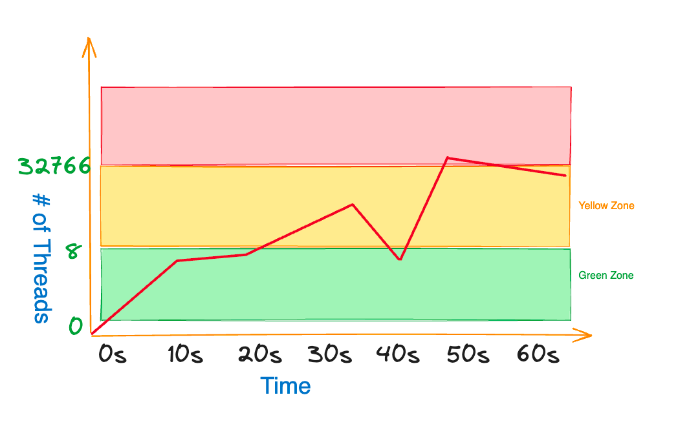

<head>
<meta property="og:image:width" content="1200"/>
<meta property="og:image:height" content="500"/>  
<meta name="twitter:creator" content="@madnan_rafiq" />
<meta name="twitter:card" content="summary_large_image" />
<meta name="twitter:title" content="A tale of migrating an ASP.NET Framework 4.x application to ASP.NET 6" />
<meta name="twitter:description" content="Thread Starvation Detection or Hangs in ASP.NET 6 and beyond are tricky and require understanding of few concepts and tools. If you migrating an ASP.NET Framework 4.x application to .NET6+ and con not convert all paths to async then you should definitely keep reading." />
</head>


The .NET migration from ASP.NET Framework 4.x to ASP.NET6 or upcoming ASP.NET8 is going
to be on the rise in the next few years due to different reasons. 
Your reasons may vary from pure business value to upgrading the stack to use better tools & resources.
Some teams may even do it to reduce the bill or for the heck of it.
All are valid reasons.

One of the team with my current Employer is migrating a .NET Framework 4.x web application to .NET6
which serves up to 4K concurrent users. 
Before going to production,
there is a process
to certify the release
by running a load test for at least 1X of the expected load which is 4K concurrent users in this application.

During the load test application started to experience a huge number of errors, mainly two types:
- Sql Connection pool ran out of connections.
- A key web service started throwing exceptions while communicating with the service. It is a SOAP service which is consumed using WCF Core Client Proxy with `basicHttpBinding`.

The ASP.NET Framework 4.x version of the application did not experience these problems.
So what changed in .NET6 and how will you find out what is wrong?
Because there are thousands of different requests at play.

## Youtube Video

I have recorded a detailed YouTube video if you prefer the video content.

[Detect ASP.NET Core Hangs](https://youtu.be/Fz6UfmqxuCM)

<!--truncate-->

## How do you diagnose the unhealthy state of application?

You have nice structured logging enabled such as Serilog,
which is providing you insights about the kind of errors happening in your application.
But if it is not logical errors, then logs are not going to be great help but still provide you some context.
For example, your application depends upon an important WCF Core Service,
and it is throwing error like 'Send time out exceeded' but some operations are succeeding at the same time.
At this point, it is very tempting to play the guess game based on the overall knowledge & context you have.
You may even get it right to fix the issue.
But `dotnet` comes with diagnostic tools which are tailor-made for such situations.

Some of these Cross-platform CLI tools are:

1. `dotnet-trace` - Collects traces by watching the process, and usefully in CPU profiling.
2. `dotnet-counters` - Monitor and Collect a variety of counters including .NET GC.
3. `dotnet-dump` - Captures and has the ability to analyze a process dump (full, mini, and triage)
4. `dotnet-gcdump` - Captures a dump focused on .NET Garbage Collection Behavior
5. `dotnet-stack` - Captures the stack traces of threads in running.NET process which is similar to what you see when you debug in your IDE

:::tip
You can install the above tools by running the following command `dotnet tool install --global tool-name`
::: 

If your organization has monitoring tools at scale like DynaTrace or Datadog,
those can be really handy in diagnosing issues,
but they sometime have limited trace information, so these tools will come handy.

## Migrating a Legacy .NET Framework Application

The most common examples of technical debt in .NET applications are:

1. Using `sync` methods with communicating with a service like database, WCF Service etc. 
2. Using `async` methods in `sync` way like using `.Result` property of the `Task`.
3. Chatty communication with the database. 

The application in question was/is doing all of the above.
You might be thinking that you must pay all the debt at once.
But it is not feasible in the context of this application like many others.

You must be thinking why?
Not all features of the application are equal.
Neither in value nor in performance expectations.
If your application has say 10 different end points,
 only a few of them are going to be on hot path unless all of them are which is not the case most of the time.
For example, a LinkedIn hot path is viewing the profiles,
so you would optimize the hot path first as per your user expectations. 

## Chatty communication with the database

The DynaTrace trace showed
that .NET6 distributed SQL Server Session was the chatty part, so it was an easy fix
to use the memory cache to reduce the chattiness.

Currently, it uses SQL Server Distributed Session backed by regular SQL Server File Tables. 
I noticed that the Sql Server Distributed Session Package does not support InMemory OLTP, which is a bummer.
Additionally, it uses lock to clear up the expired entries which could be done in the background hosted service at the specified interval.

## Use of `sync` operations of WCF Client Proxy

It takes considerate effort to convert the whole path of stack to `async` in other words all the way down async.
It also requires regression testing or use of feature flags
to incrementally release it, especially when legacy application is stable.  

:::tip
Ideally you should convert all the way down to async to get the most out of the .NET performance.
It will save time spent on diagnosing issues which can bring down the production.
:::

## What is the problem with sync operations?
It is an important question as the answer will reveal the concept of "Hill Climbing" algorithm.
[Hill Climbing](https://github.com/dotnet/runtime/blob/main/src/libraries/System.Private.CoreLib/src/System/Threading/PortableThreadPool.HillClimbing.cs) is the way .NET Thread Pool adjusts the number of concurrent threads available to execute.
It makes new threads available after 500 milliseconds based on multiple factors like the number of threads
completing the work,
and when the max thread count is reached it no longer adds threads unless in progress work gets completed.

Consider if the application end point is concurrently consumed by 1000 users.
Then the question is that can your hosted application handle it
if all requests land on the same host with the default thead pool config. 

The answer is it depends? To understand that, we will have to look at two key things:

1. Configurations of your host.
2. Latency of the said operation.

Thread Pool defaults to minimum worker threads depends upon the number of cores available on the machine.
If there are two cores, then the minimum worker threads will be 4. The minimum IOCP threads default to 1000. 

If thousands request lands on the host and each request takes about 500 milliseconds to complete,
then the thread pool will be able to handle four requests concurrently.
For the fifth request and so on,
it will wait 500 milliseconds to add a new worker thread before it reaches to the max thread count.

In this scenario, if the host application is processing the first four requests,
then what will happen to the rest of the requests?

The answer is that they will be queued up in the thread pool queue.

Not just that when the worker thread is doing the work,
and it reads the data from the database, that work is done by IOCP threads.
But while data is being read from the database, the worker thread is blocked,
and it is not available to process other requests.
After the IOCP is done with the work, it will signal the worker thread to continue the work.
But if the worker thread has to wait for 500 milliseconds to be available,
then the IOCP thread will be blocked for that time as well.

The question is
what will happen to the timeout
configured for reading the data from the database or reading the data from the WCF Service?
The answer is that the operation will time out and throw an exception.

Now you have two big problems:
1. Requests are queued. 
2. Operations are timed out.

Additionally,
you may exhaust the connection pool of the database as well
because the connection will not be released until the IOCP thread can resume work on the worker thread.

On the client side, you may experience the timeout exceptions
because the number 1000 requests will take few minutes to get thread allowed.

## Thread Pool Zones

You can see build a conceptual model of the thread pool by dividing it into three zones:



Green zone ends when all the minimum worker threads are busy.
As soon as the minimum worker threads are busy, you are in the yellow zone
that only injects new threads after 500 milliseconds.
But once that limit is reached, you are in danger zone that is the red zone.
It means that no new threads will be added to the thread pool unless the in progress work is completed.

## How do I diagnose the problem?

You can use the `dotnet-counters` tool to monitor the thread pool counters.
To do that, you will have to run the following command:

```bash
dotnet tool install --global dotnet-counters
dotnet-counters monitor --process-id <process-id> 
```
And to find the process id, you can use the `dotnet-process` tool as follows:

```bash
dotnet-counters -p
```

It will output all the counters available for the process. Near the bottom you will see the following counters:

1. `ThreadPool Completed Work Item Count`
2. `ThreadPool Queue Length`
3. `ThreadPool Thread Count`

Observe the values of these counters.
If the `ThreadPool Queue Length` is increasing,
then it means that the requests are being queued up.

## How to fix the problem - Easy but not right way?

The easiest way to fix the problem is to increase the number of minimum worker threads.
You can achieve it number of ways, I will show you two ways:

1. Using `ThreadPool.SetMinThreads` method during the startup of the application.
2. Create the `runtimeconfig.template.json` at the root of your project. 

```json
{
    "configProperties": {
      "System.Threading.ThreadPool.MinThreads": 2,
      "System.Threading.ThreadPool.MaxThreads": 4,
      "System.Threading.ThreadPool.Blocking.ThreadsToAddWithoutDelay_ProcCountFactor": 2
    }
}
```

Note that `System.Threading.ThreadPool.Blocking.ThreadsToAddWithoutDelay_ProcCountFactor` is added after .NET6
to better control the burst requests load.

:::tip
If you are opting out to increase the number of minimum worker threads,
then you must pay attention to the CPU utilization.
It must be low otherwise you will matter worse because the CPU will be busy context switching.
:::

## How to fix the problem - Hard but right way?

The right way to fix the problem is to convert the whole path to async. 

You might be wondering why it is hard?
Few reasons:
- It requires a lot of effort.
- It requires regression testing.
- You have to convert the whole path to async, that may also include updating code paths wherever that method is called.
- You will also have to convert all unit tests.

Having said that, it is the right way to do it. 

## WCF Client Proxy Faulty Sync Behavior

Though you may be able to fix the problem by increasing the number of minimum worker threads.
But the traces may show that your application is spending a majority of its time in locking.

It is caused by the WCF Proxy Client 
that uses unsafe wait for sync operation as it is calling the `WaitHandle.WaitOne` method.
It can make the IOCP thread continuation to the worker thread stuck in the lock.

The hack around it is to call the **async** method inside the `Task.Run` as follows:

```csharp
//Forces the work to happen on the thread pool thread
//avoid the unsaif wait for sync operation in the WCF Client Proxy
//It calls async method
Task.Run(() => client.ASyncMethod()).GetAwaiter().GetResult();
```
You can watch and subscribe to my channel to watch short & concise videos [here](https://youtu.be/N1cSCSS1rkU).

## How to see traces of hung threads?

You can use the `dotnet-dump` to create a dump of the process. To install and create the dump, you can run the following command:

```bash
dotnet tool install --global dotnet-dump
dotnet-dump collect --process-id <process-id> --type full
```

Once the dump is created, you can use the `dotnet-stack` tool to see the stack traces of the threads. 

But the easiest way to get a comprehensive report of all the threads is to use the "Debug Diag" tool,
which only works on Windows.
You can download it from [here](https://www.microsoft.com/en-us/download/details.aspx?id=58210).


## Feedback
I would love to hear your feedback, feel free to share it on [Twitter](https://twitter.com/madnan_rafiq). 

