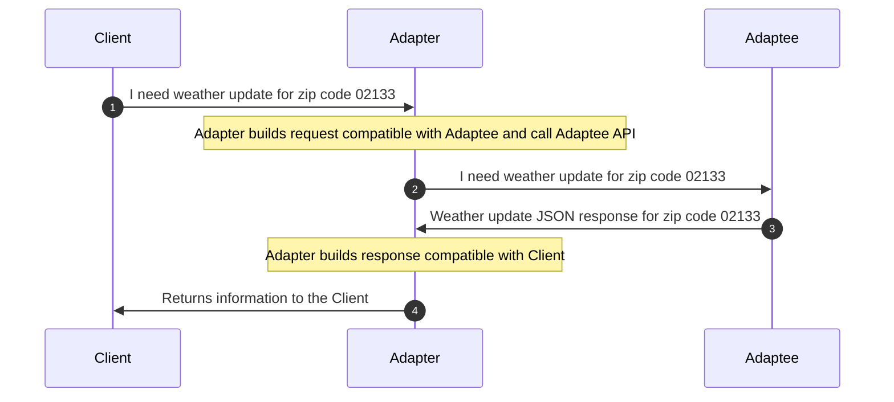
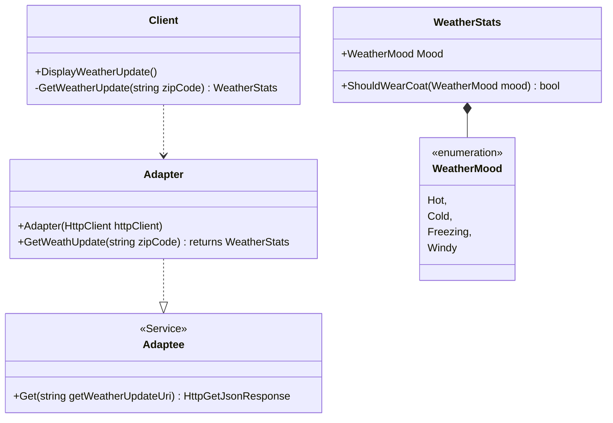

<head>

<meta property="og:image:width" content="1200"/>
<meta property="og:image:height" content="670"/>  
<meta name="twitter:creator" content="@madnan_rafiq" />
<meta name="twitter:title" content="What, Why and How of Adapter Pattern in C#" />
<meta name="twitter:description" content="What is Adapter Pattern? Why or what problem it solves? How to implement it in C#." />
</head>

## What is an Adapter Pattern?
The Adapter Pattern connects two incompatible objects by exposing an interface compatible with the Client. The object refers to a class, web service, REST API, process, or physical device depending upon your context.

Consider a C# Web Application displaying Weather Updates on its landing by utilizing the third-party REST API.

In this application, there are three participating objects in the Adapter Pattern:
1. A Weather REST API (Adaptee) has the functionality of weather updates. The Weather REST API only understands JSON.
2. The C# MVC Web Application (Client) displays weather updates on its landing page using the Weather Web Service.
3. The Adapter enables the Client to utilize the Adaptee functionality. It does that by doing two things:
   1. It converts the Client's input to the format acceptable to Adaptee i.e. JSON to C# Object(s).
   2. It converts the Adaptee's output to the format acceptable to the Client i.e. C# Object(s) to JSON.

<!--truncate-->

A sequence diagram of an Adapter Pattern is below:


Any application that integrates with other services might already use an Adapter Pattern in the form of SDK. Some examples are below:
- AWS S3 C# SDK is an Adapter that hides the REST API (Adaptee).
- C# OAUTH 2.0 SDK for Authorization.
- Virus Scanner, which utilizes unmanaged code.
- Reading MS Office files.
- CSV Reader.

In light of the above examples, any IO-based operations essentially implement an Adapter Pattern.

:::info A Tip, but It depends upon your context.
Applying an Adapter Pattern to match the Adaptee with your application domain language is often beneficial. In the DDD context, an Anti-Corruption Layer implements an Adapter Pattern.
For example, an internal or third-party service might use very different naming conventions than your application.
An old JAVA SOAP Web Service often uses underscore in properties names such as first_name, last_name, user_role, etc.
:::

## Why use it?
It encapsulates the conversion of input & output and communication between the Client and Adaptee.
The conversion can be as simple as C# object to JSON and vice versa or writing a custom parser to understand the XML elements.

Though replacing the Adaptee is not the primary intent of the pattern, C# implementation can help replace the Adaptee without changing the Client usage call-site.
The new Adaptee must provide the same business operations for any replacement to succeed. An Adapter pattern can be helpful to migrate legacy applications to newer implementations slowly.

:::tip
The Adapter Pattern is similar to the Wrapper Pattern, where a wrapper around the original implementation makes the API match the current application domain context.  
:::

## How to implement it?

A class diagram and implementation of the Adapter Pattern is below:



```csharp title="An example implementation of an Adapter Pattern."
//MVC controller returning weather update view - controller is acting as Client
public class DashboardController : Controller
{
    private readonly IWeatherServiceAdapter _weatherServiceAdapter;
    public DashboardController(IWeatherServiceAdapter weatherServiceAdapter){
        _weatherServiceAdapter = weatherServiceAdapter;
    }
    public IHttpAction DisplayWeatherUpdate(string zipCode){
        
        return View("WeatherDashboard", GetWeatherUpdate());
        
        WeatherStats GetWeatherUpdate(){
            var weatherStats = _weatherServiceAdapter.GetWeatherUpdate(zipCode);
            return weatherStats;
        }
    } 
}
//Adapter interface
public interface IWeatherServiceAdapter{
    Task<WeatherStats> GetWeatherUpdate(string zipCode);
}
//Adapter interface implementation 
//It hides communication to REST API, and transformation of request and response
public class WeatherServiceAdapter : IWeatherServiceAdapter
{
    private readonly HttpClient _httpClient;
    private readonly string _remoteServiceBaseUrl;

    public WeatherServiceAdapter(HttpClient httpClient)
    {
        _httpClient = httpClient;
    }

    public async Task<WeatherStats> GetWeatherUpdate(string zipCode)
    {
        var uri = string.Join(_remoteServiceBaseUrl, "/", zipCode);
        //call the REST endpoint of weather service (Adaptee)
        var responseString = await _httpClient.GetStringAsync(uri);
        //Transforming the JSON response to C# object which is acceptable the Client (Controller) 
        var weatherStats = JsonConvert.DeserializeObject<WeatherStats>(responseString);
        return weatherStats;
    }
}
//DashboardController acting as Client, makes use of WeatherStats
//Note that REST API returns a JSON response
public class WeatherStats{
    public WeatherMood Mood {get;set;}  
    public bool ShouldWearCoat(WeatherMood mood)=> mood == WeatherMood.Hot;
}
public enum WeatherMood
{
    Hot,
    Cold,
    Freezing,
    Windy
}
```

## Feedback
I would love to hear your feedback; feel free to share it on [Twitter](https://twitter.com/madnan_rafiq). 
