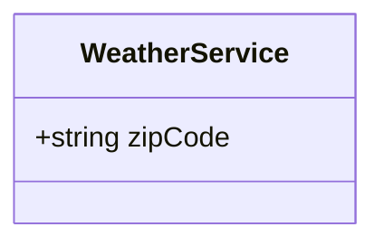

<head>

<meta property="og:image:width" content="1200"/>
<meta property="og:image:height" content="670"/>  
<meta name="twitter:creator" content="@madnan_rafiq" />
<meta name="twitter:title" content="What, Why and How of Adapter Pattern in C#" />
<meta name="twitter:description" content="What is Adapter Pattern? Why or what problem it solves? How to implement it in C#." />
</head>

Image by [awcreativeut](https://unsplash.com/@awcreativeut)

## What is an Adapter Pattern?
The Adapter Pattern connects two incompatible objects by exposing an interface compatible with the Client. The object refers to a class, web service, REST API, process, or physical device depending upon your context.

Consider a C# Web Application displaying Weather Updates on its landing by utilizing the third-party REST API. 

In this application, there are three participating objects in the Adapter Pattern:
1. A Weather REST API (Adaptee) has the functionality of weather updates. The Weather REST API only understands JSON.
2. The C# MVC Web Application (Client) displays weather updates on its landing page using the Weather Web Service.
3. The Adapter enables the Client to utilize the Adaptee functionality. It does that by doing two things:
   1. It converts the Client's input to the format acceptable to Adaptee. 
   2. It converts the Adaptee's output to the format acceptable to the Client.

<!--truncate-->

Any application that integrates with other services might already be using an Adapter Pattern in form of SDK. Some examples are below:
- AWS S3 C# SDK is an Adapter that hides the REST API (Adaptee). 
- C# OAUTH 2.0 SDK for Authorization.

:::info A Tip, but It depends upon your context. 
Applying an Adapter Pattern to match the Adaptee with your application domain language is often beneficial. In DDD context it is also refereed as Anti Corruption Layer.
For example, an internal or third-party service might be using a very different naming conventions than your application.
An old JAVA SOAP Web Service often use underscore in properties names such as first_name, last_name, user_role etc. 
Currently, my team is replacing the Adaptee from SOAP to REST API.  
:::

## Why to use it?
It encapsulates the conversion of input & output and communication between the Client and Adaptee. 
The conversion can be as simple as C# object to JSON and vice versa, or writing custom parser to understand the XML elements.

Though replacing the Adaptee is not the primary intent of the pattern, C# implementation can help replace the Adaptee without changing the Client usage call-site.
The new Adaptee must provide the same business operations for any replacement to succeed. An Adapter pattern can be helpful to migrate legacy applications to newer implementations slowly.

:::tip
The Adapter Pattern is similar to the Wrapper Pattern, where a wrapper around the original implementation makes the API match the current application domain context.  
:::

## How to implement it?

## Feedback
I would love to hear your feedback, feel free to share it on [Twitter](https://twitter.com/madnan_rafiq). 

